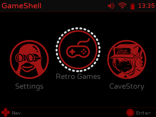
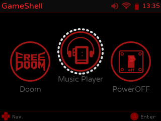
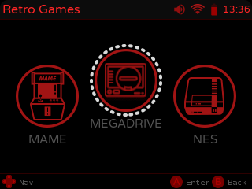
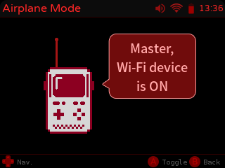
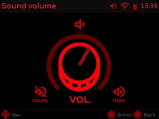

# ClockworkPi-Skins
Skins for the ClockWorkPi Launcher, ClockWorkPi can be found here: https://www.clockworkpi.com/
The Launcher is the UI on the console. All skins currently require ssh access to the Pi, which is beyond the scope of this page. Please see [this](https://forum.clockworkpi.com/t/how-to-transfer-files-with-tinycloud-through-ssh/833) forum post for instructions on how to ssh into your console.

Installation of any skin found on this page, should be pretty easy, if git is installed. 

_please note, I changed the way skins are installed below. Instead of moving the skin, to the skins directory, I decided to link it; this should help if/when a skin gets updated._

### Install Git
```
sudo apt-get install git
```

### Switching Skins
At the time of this writing, this is still a manual process, hopefully the devs fix this soon!
As an example, I'll show the steps the switch the skin from default, to blue (assuming blue is already installed).
Ssh into your console, and make the following changes (one of the other, not both)

#### Manually (with vi)
```
vi /home/cpi/apps/launcher/sys.py/config.py
```
replace SKIN="detault" with SKIN="blue"
(save and quit the file)

#### Automagically (with sed)
The quick way, if your impatient, or not a vi fan:
```
sed -i 's/SKIN="default"/SKIN="blue"/' /home/cpi/apps/launcher/sys.py/config.py
```

### Alternative Method to Switching Skins
This was brought up by [hpcodecraft](https://forum.clockworkpi.com/t/skin-development/931/18) in the forums; I think I like it a little better, feels cleaner to me. Instead of editing the config.py file (above; which gets overwritten after each launcher update), we simply create symbolic links to different directories. At the end of the day, what ever link in pointing to "default" gets used as the skin. 

To set this up, ssh into your console and run the following:
```
cd /home/cpi/apps/launcher/skin
mv default original
```
install some skins below (in this example, I'll switch to the Redrum skin)
```
cd /home/cpi/apps/launcher/skin
ln -s /home/cpi/CWP-Skin-Redrum/redrum/ /home/cpi/apps/launcher/skin/
ln -s redrum default
```

So now, because the link "default" is pointing to "redrum", the Redrum skin will be used. To verify, "ls -lh /home/cpi/apps/launcher/skin" should look like the following:
```
cpi@clockworkpi:~/apps/launcher/skin$ ls -hl
total 4.0K
lrwxrwxrwx 1 cpi cpi   29 Aug  3 09:22 blue -> /home/cpi/CWP-Skin-Blue/blue/
lrwxrwxrwx 1 cpi cpi    6 Aug  3 09:23 default -> redrum
drwxr-xr-x 5 cpi cpi 4.0K Jun  1 03:32 original
lrwxrwxrwx 1 cpi cpi   33 Aug  3 09:15 redrum -> /home/cpi/CWP-Skin-Redrum/redrum/
```

To switch back to the default skin, simply run the following:
```
cd /home/cpi/apps/launcher/skin
rm default
ln -s original default
```

### Reboot
reboot the console
```
sudo reboot
```

# Blue
This is my first skin, and was more of a proof-of-concept, to see if the launcher could be skinned. 


To install this skin, ssh into your console, and type the following:
```
cd ~/
git clone https://github.com/xstrex/CWP-Skin-Blue.git
ln -s /home/cpi/CWP-Skin-Blue/blue/ /home/cpi/apps/launcher/skin/
```

# Redrum
Second Skin - Took the time to colorize every single image, should look more complete. 









To install this skin, ssh into your console, and type the following:
```
cd ~/
git clone https://github.com/xstrex/CWP-Skin-Redrum.git
ln -s /home/cpi/CWP-Skin-Redrum/redrum/ /home/cpi/apps/launcher/skin/
```

_profit!_
