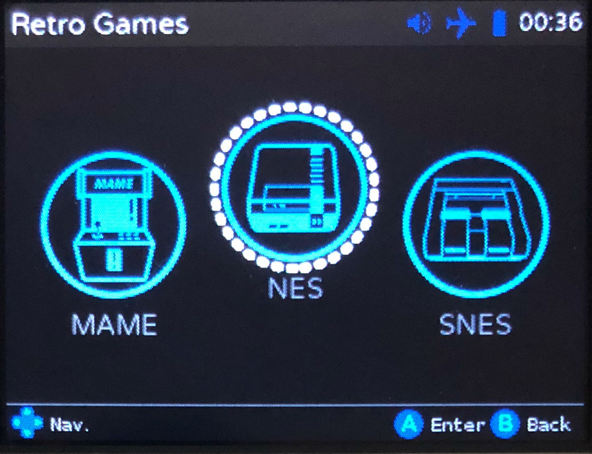

# ClockworkPi-Skins

Skins for the ClockWorkPi Launcher, ClockWorkPi can be found here: https://www.clockworkpi.com/
The Launcher is the UI on the console. All skins currently require ssh access to the Pi, which is beyond the scope of this page. Please see [this](https://forum.clockworkpi.com/t/how-to-transfer-files-with-tinycloud-through-ssh/833) forum post for instructions on how to ssh into your console.

Installation of any skin found on this page, should be pretty easy, if git is installed. 

### Install Git
```
sudo apt-get install git
```

# Blue
This is my first skin, and was more of a proof-of-concept, to see if the launcher could be skinned. 




To install this skin, ssh into you console, and type the following:
```
cd /home/cpi/apps/launcher/skin
git clone https://github.com/xstrex/CWP-Skin-Blue.git .
```


_profit!_
